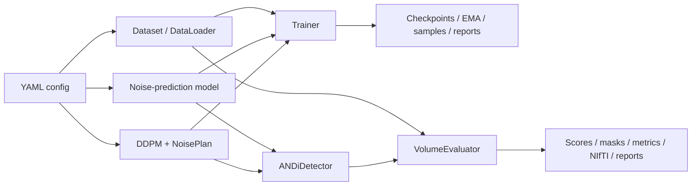

# ANDi Rewrite

`andi_rewrite` 是以 PyTorch 實作的研究型 MRI anomaly detection 框架。它以健康的多模態 2D MRI slices 訓練 DDPM noise predictor；評估時把 3D volume 沿 axial 軸拆成 slices，計算多個 diffusion timestep 的 transition deviation，聚合成 3D anomaly score，再執行後處理、voxel-level metrics 與可選的 NIfTI prediction export。

目前版本為 `0.1.0`。本 repository 是 YAML 驅動的本機 CLI 專案，不是 Web/API 服務，也沒有資料庫、佇列、排程器或臨床部署層。程式碼沒有宣告臨床用途或提供臨床安全控制。

## 文件導覽

| 文件 | 適合先讀的情境 |
|---|---|
| [架構與執行流程](docs/architecture.md) | 理解系統邊界、模組責任、資料流、狀態、錯誤與限制 |
| [YAML 設定參考](docs/configuration.md) | 建立或修改 training/evaluation config |
| [後處理與 threshold](docs/postprocessing.md) | 比較 `rewrite` / `original_andi`、Yen / Otsu、score / mask pipelines |
| [開發與驗證](docs/development.md) | 建立環境、執行測試、使用 scripts、擴充 factory/registry |
| [UCSF-PDGM adapter](docs/datasets/ucsf-pdgm.md) | 查閱現行 channel、discovery、geometry、CSV 與 metadata 契約 |
| [UCSF-PDGM 儲存檢查快照](UCSF_PDGM_storage_inspection_report.md) | 查閱特定本機資料樹在檢查當下的格式與統計 |

文件以目前程式碼為準。維護範圍是 `README.md`、`docs/**` 與上表明列的 root 歷史快照；被忽略的 `outputs/**` 一律視為 runtime artifacts。可生成的 report 應由 generator 重建，frozen/manual report 應封存，兩者都不是 current architecture/API 文件。

## 核心能力

- 2D DDPM noise-prediction training，預設四個邏輯通道依序為 `flair`、`t1`、`t1ce`、`t2`。
- `ANDiUNet` 與 `ConvNeXtUNet` model factory。
- Gaussian、Pyramid、Spectrum、Empirical Spectrum 與 Hybrid noise sampler。
- Static 與 epoch-switch noise plan；目前 checked-in YAML 都使用 static plan。
- AdamW、warmup-cosine scheduler、EMA、checkpoint resume 與 reverse-sample 圖片輸出。
- Raw BraTS healthy-slice、LMDB slice、BraTS-style volume、Shifts/Ljubljana-MS 與 UCSF-PDGM dataset adapters。
- In-memory 與單程序 disk-streaming full-volume evaluation。
- 可組合的 anomaly aggregation、postprocess registry、Yen/Otsu adaptive threshold、threshold sweep 與 NIfTI prediction export。
- 可選的 Hugging Face Accelerate training/in-memory evaluation；disk streaming 不支援 distributed execution。
- Healthy-slice LMDB、K-fold、empirical spectrum、registration、diagnostic 與 figure scripts。

## 一分鐘理解執行流程



訓練學習的是 sampled noise。異常偵測不是跑一條完整的 diffusion trajectory：每一個選定 timestep 都從同一個 clean slice 以 closed-form `q_sample` 獨立加噪，再比較真實 noise 與模型預測 noise 所導出的 posterior mean；平方差經 timestep 與 modality 聚合後成為 anomaly score。

## Repository 結構

```text
andi_rewrite/
├─ anomaly/       detector、aggregation registry、postprocess policies
├─ configs/       可直接執行的 templates 與實驗快照
├─ data/          datasets、healthy-slice preprocessing、registration
├─ diffusion/     DDPM scheduler 與 transition math
├─ docs/          維護中的架構、設定、後處理與開發文件
├─ engine/        Trainer、VolumeEvaluator、disk cache、checkpoint、EMA、LR
├─ metrics/       AUPRC、Dice、confusion metrics 與 CSV writer
├─ models/        ANDiUNet、ConvNeXtUNet 與 factory
├─ noise/         noise samplers、plans 與 factory
├─ scripts/       CLI composition roots、資料與實驗工具
├─ splits/        checked-in subject split CSV
├─ tests/         unittest/pytest-compatible tests
└─ utils/         config、reporting、progress、seed、statistics、visualization
```

`outputs/`、`results/`、checkpoints、LMDB、NPZ 與 NIfTI 多數由 `.gitignore` 排除，屬於本機資料或執行產物。專案沒有 central experiment database。

## 環境

Repository 目前沒有 `pyproject.toml`、`requirements.txt`、Conda environment、lockfile 或 Dockerfile，因此沒有可由 repository 重建的版本組合。Python 語法至少需要 3.10；PyTorch/CUDA 應依執行平台安裝。

程式實際 import 的套件分組如下：

| 用途 | 套件 |
|---|---|
| 核心 | `torch`, `torchvision`, `numpy`, `pandas`, `PyYAML`, `Pillow` |
| MRI / storage | `nibabel`, `lmdb` |
| 後處理 / metrics | `scipy`, `scikit-image`; `scikit-learn` 為 AUPRC 首選實作 |
| Figures / diagnostics / 進度 | `matplotlib`, optional `tqdm` |
| 分散式 | optional `accelerate` |
| 資料配準 | optional `dipy`, `SimpleITK` |
| 測試 | `pytest` |

完整依賴分層、目前驗證環境與 optional fallback 見 [開發與驗證](docs/development.md)。不要把上表當作版本鎖定。

## 快速開始

以下命令假設工作目錄是 repository root。多數 `scripts/*.py` 會透過 `scripts/_bootstrap.py` 加入 package parent，因此可直接以 script path 執行。

先查看 CLI：

```powershell
python -B scripts\train.py --help
python -B scripts\eval.py --help
```

先複製最接近的 canonical config，填入有效 dataset paths。建立 components 並執行單一 training batch：

```powershell
python -B scripts\train.py --config <prepared-train-config.yaml> --run-one-step
```

完整訓練：

```powershell
python -B scripts\train.py --config <prepared-train-config.yaml> --fit
```

`configs/train_lmdb.yaml` 本身是 20-epoch template，但 checkpoint/sample 的 `start_epoch` 都是 120，所以直接 `--fit` 只會完成 training 與 report，不會寫 checkpoint/sample。需要 artifacts 時，複製後把相應 `start_epoch` 與 `every_epochs`/`save_every_epochs` 調到本次 epoch 範圍內。

Full-volume evaluation：

```powershell
python -B scripts\eval.py --config <prepared-eval-config.yaml> --run-eval
```

執行前必須確認 volume root、CSV 與 `model.checkpoint` 均有效且 checkpoint 非空；`configs/eval.yaml` 的 checkpoint 是空值，直接執行會評估 random-initialized model。

CLI 唯一通用的 evaluation override 是 threshold method：

```powershell
python -B scripts\eval.py --config <prepared-eval-config.yaml> --run-eval --threshold-method otsu
```

這些命令在執行前都必須先修改 YAML 中的 dataset、CSV、checkpoint、spectrum 與 output paths。許多 checked-in config 是特定 Windows 實驗的快照，包含本機絕對路徑；`configs/train.yaml` 的預設 CSV path 也不指向 repository 內同名資料。Config loader 不會展開 environment variable、做 include/inheritance 或驗證完整 schema。

### Canonical configs

- `configs/train.yaml`：直接讀取 raw BraTS healthy slices 的 training template。
- `configs/train_lmdb.yaml`：讀取預處理 LMDB 的 training template。
- `configs/eval.yaml`：`rewrite` postprocess 的 standalone evaluation template。
- `configs/eval_original_andi.yaml`：reference-compatible `original_andi` postprocess template。

其餘 `configs/**/*.yaml` 多為具體資料集、checkpoint、fold 或研究比較的可追溯實驗設定，不代表通用預設。完整 section 與 precedence 見 [YAML 設定參考](docs/configuration.md)。

## 資料契約

| Adapter | 主要用途 | 回傳形狀 / 行為 |
|---|---|---|
| `LMDBSliceDataset` | 健康 slice training | pickled NumPy value，`[C,H,W]` |
| `BraTSHealthySliceDataset` | 從 raw BraTS + slice CSV training | `[C,H,W]`，cache 最近一位 subject |
| `MRIDataVolume` | BraTS-style evaluation | image `[C,H,W,Z]`、mask `[H,W,Z]`；不驗證跨 modality geometry |
| `ShiftsMSVolumeDataset` | Shifts/Ljubljana/BEST/MSSEG layout | 可補零缺失 modality，並將資料 resample 到 reference grid |
| `UCSFPDGMVolumeDataset` | UCSF-PDGM evaluation | 嚴格要求四 modality + tumor segmentation，驗證 shape/spacing/orientation/affine |

四通道的邏輯順序為 `[flair, t1, t1ce, t2]`。UCSF adapter 將它映射到實際檔名 `[FLAIR, T1, T1c, T2]`。通用/Shifts volume adapter 以 `segmentation > 0.5` 產生 binary mask；UCSF adapter 以 `segmentation > 0` 將多類別 labels 轉成 whole-tumor mask。

Healthy-slice LMDB 以八位數 ASCII key（如 `00000000`）保存 pickled NumPy array。`--overwrite` 會遞迴刪除指定的既有 LMDB output directory，使用前應再次確認目標 path。詳細 preprocessing 與各 adapter 差異見 [架構與執行流程](docs/architecture.md#資料層與-adapters)。

## 訓練輸出與 checkpoint

`Trainer` 對 `[0,1]` input 預設轉為 `[-1,1]`，隨機抽取 `[1, diffusion.steps)` 的 timestep，以 MSE 學習 noise。可輸出：

```text
<checkpoint.dir>/<run_name>/epoch_XXXX.pt
<samples.output_dir>/<run_name>/epoch_XXXX.png
<checkpoint.dir>/<run_name>/training_report.md
<checkpoint.dir>/<run_name>/training_report.json
```

Checkpoint 保存 epoch、model、optimizer、training subsection config，並視設定保存 scheduler、EMA model 與 EMA state。它不保存 RNG、DataLoader sampler、loss history 或完整 run config，因此 resume 不是 bitwise replay。只應載入可信的 PyTorch checkpoint。

## 評估輸出

Standalone `scripts/eval.py --run-eval` 可產生：

- Raw 與 MF metric CSV，預設為 `ANDi.csv`、`ANDi_mf.csv`。
- `inference_report.md`、`inference_report.json`、`inference_metrics_summary.csv`。
- 可選的 per-subject NIfTI scores、adaptive/fixed masks 與 `prediction_metadata.json`。
- Disk-streaming mode 的 `.npy` cache 與 manifest。

Metric CSV 的實際欄位是 `thr,value,dice,sensitivity,precision`；threshold sweep 使用 end-exclusive `np.arange(thr_start, thr_end, thr_step)`，再四捨五入到三位。Dice 是 per-subject mean；confusion rates 是全 voxel micro aggregate；adaptive Yen/Otsu threshold 則逐 subject 的完整 3D score volume 計算。

Prediction export 的典型檔名：

```text
anomaly_score_raw.nii.gz
anomaly_score_mf.nii.gz
lesion_mask_<method>_raw.nii.gz
lesion_mask_<method>_mf.nii.gz
lesion_mask_<method>.nii.gz
prediction_metadata.json
```

Native-grid restoration 只依 shape 做 trilinear score / nearest mask resize，再沿用 reference NIfTI affine/header；它不是一般 affine registration。

## 測試

測試可由 `pytest` 或標準 `unittest` discovery 執行：

```powershell
python -B -m pytest -q -p no:cacheprovider
python -B -m unittest discover -s tests -v
```

本次文件更新的 dated 驗證結果、環境版本與 coverage 邊界記錄在 [開發與驗證](docs/development.md#3-建議驗證順序)。測試重點涵蓋 dataset discovery/UCSF geometry、empirical spectrum、noise statistics、postprocess、prediction/reporting、streaming cache/AUPRC 與 comparison figures；未涵蓋真實資料完整訓練、registration、checkpoint resume 或 Accelerate multi-process integration。

## 重要限制與安全邊界

- 專案只透過本機 filesystem 讀寫資料，沒有 network client、HTTP endpoint、auth 或 secrets manager。
- LMDB values 會經 `pickle.loads`，checkpoint 會經 `torch.load`；只使用可信來源的 LMDB 與 checkpoint。
- 空的 evaluation checkpoint 設定不會阻止執行，會評估隨機初始化模型；正式執行前應明確檢查 `model.checkpoint`。
- `in_memory` evaluation 會把所有 score/labels 留在 RAM；大型資料集應考慮 single-process `disk_streaming`。
- Standalone disk streaming 也可逐 cached subject 匯出 NIfTI predictions；它仍是單程序，且 export 會發生在 streaming metrics pass。
- 只要一個 subject 沒有 label，該次 evaluation 的 label-based metrics 就會整體標成 unavailable。
- `set_seed` 與 cuDNN flags 可改善重現性，但程式沒有啟用 deterministic algorithms，不能保證 bitwise determinism。
- `scripts/prepare_data.py` 的 histogram matching 會原地覆寫目標 NIfTI；LMDB `--overwrite` 與成功後 cache cleanup 也會刪除目錄。
- Auto-evaluation after training 與 batch checkpoint evaluator 的 config 傳遞不完全等同 standalone `scripts/eval.py`；需要 prediction export 或完整 fingerprint 時，應優先使用 standalone evaluation。詳見 [架構文件的目前實作差異](docs/architecture.md#12-目前實作差異與已知邊界)。
