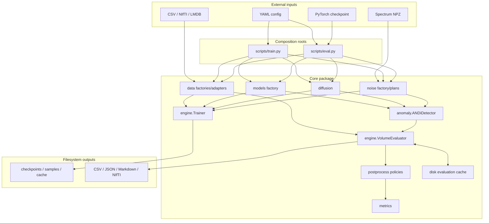
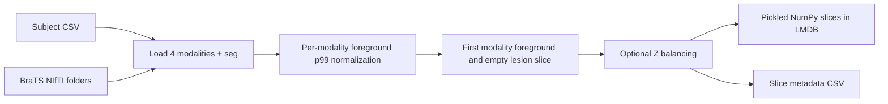
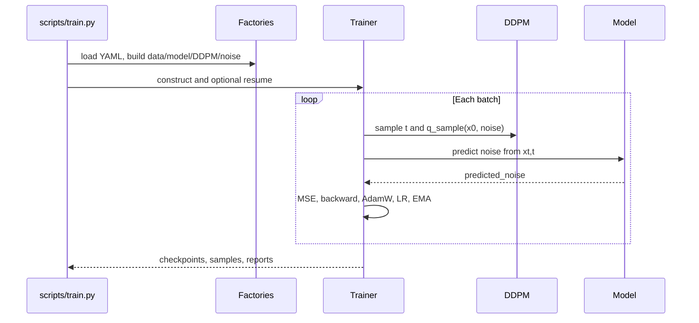

# 系統架構與執行流程

本文件描述目前 repository 的實際程式碼，而不是預期中的未來設計。2026-08-12 inventory snapshot 包含 66 個 Python source、90 個 YAML config、7 個 test modules 與主要 scripts；數量會隨 repository 演進。YAML 的逐項設定請配合 [configuration.md](configuration.md)，後處理細節請配合 [postprocessing.md](postprocessing.md)。

## 1. 系統目的與邊界

ANDi Rewrite 是單一 Python package 內的研究型 MRI anomaly detection 系統：

1. 從健康的多模態 2D MRI slice 學習 DDPM noise prediction。
2. 評估 3D volume 時，沿 Z 軸展平成 2D axial slices。
3. 對每個選定的 diffusion timestep，從 clean slice 獨立做 closed-form forward noising。
4. 比較真實 noise 與模型預測 noise 所導出的 DDPM posterior mean，平方差形成 anomaly evidence。
5. 沿 timestep 與 modality 聚合，重組 3D anomaly score。
6. 後處理 score、逐 subject threshold、計算 voxel metrics，並可輸出 NIfTI。

系統邊界是本機 CPU/GPU 與 filesystem：YAML、CSV、NIfTI、LMDB、NPZ、PyTorch checkpoint、NumPy cache、CSV/JSON/Markdown/PNG/NIfTI outputs。程式內沒有 Web frontend、HTTP API、長駐 backend、資料庫伺服器、message queue、scheduler、使用者帳號或遠端傳輸。

這是研究框架；程式碼沒有宣告臨床用途，也沒有醫療裝置所需的資料治理、驗證、稽核或安全控制。

## 2. Architectural style

整體是 configuration-driven、layered modular monolith：

- `scripts/train.py`、`scripts/eval.py` 是 composition roots，從單一 YAML 組裝元件。
- `engine/` 擁有 training/evaluation application lifecycle。
- `diffusion/`、`noise/`、`anomaly/`、`metrics/` 包含主要數學與策略。
- `data/` 是 dataset/storage/registration adapters。
- `utils/` 與 `engine/evaluation_cache.py` 提供 filesystem infrastructure。
- Factory 隔離具體 model、dataset、diffusion 與 noise 類型。
- Registry 隔離 anomaly aggregation 與 postprocess steps。

它不是 MVC、microservices 或動態 plugin runtime。擴充點是 Python factory/registry；新增類型仍需要修改 source 並部署同一 package。



## 3. Package 與模組責任

### Composition roots 與 scripts

| Path | 責任 |
|---|---|
| `scripts/train.py` | 載入 config、設定 seed/backend、建 DataLoader/model/DDPM/noise plan/Trainer，執行 one-step、fit、sample 或 eval-after-fit |
| `scripts/eval.py` | 建 model/checkpoint/DDPM/noise/detector/DataLoader/evaluator，執行 standalone full-volume evaluation |
| `scripts/_bootstrap.py` | 將 package parent 插入 `sys.path`，讓 repository 內 scripts 可直接執行 |
| `scripts/run_5fold.py` | 產生 fold data/config，依序以 subprocess 啟動每個 fold training |
| 其他 scripts | 資料前處理、spectrum 計算、checkpoint batch evaluation、diagnostics 與 figures；詳見 [development.md](development.md#4-script-inventory) |

`load_config()` 只做 `yaml.safe_load` 並加入 `_config_path`；沒有 schema、include、inheritance、environment expansion 或 deep merge。各 factory/constructor 分散地驗證自己需要的欄位。

### 資料層與 adapters

`data/datasets.py` 提供以下資料契約：

| 類別 | Discovery / input | Output 與重要行為 |
|---|---|---|
| `LMDBSliceDataset` | LMDB 連續八位數 ASCII keys | value 經 pickle 還原為 `[C,H,W]` NumPy；每個 worker lazy-open readonly transaction；可 resize |
| `BraTSHealthySliceDataset` | CSV 第一欄 subject id、`Slice` 欄 Z；BraTS modality filenames | `[C,H,W]`；cache 最近一位 subject；每 modality 以前景 p99 normalization |
| `MRIDataVolume` | CSV 第一欄或 subject folders；BraTS-style filenames | image `[C,H,W,Z]`、binary mask `[H,W,Z]`；只 resize XY、保留 Z；不驗證 modality geometry |
| `ShiftsMSVolumeDataset` | location/split/modality archive layout | 支援 Ljubljana/BEST/MSSEG aliases、PD fallback、缺 modality 補零；必要時 resample 到 reference grid；允許缺 segmentation 時回零 mask 並標 `has_label=false` |
| `UCSFPDGMVolumeDataset` | 遞迴尋找 `*_nifti`；可用 `subject_id` CSV 篩選 | 要求完整四 modality + tumor seg；驗證相同 3D shape/spacing/orientation/affine，預設要求 LPS；保留 follow-up id |

Factory 接受的 canonical/alias types：

- `lmdb`
- `brats_healthy_slices` / `healthy_slices`
- `volume` / `mri_volume` / `brats_volume`
- `ljubljana_ms_volume` / `shifts_ms_volume` / `shifts_volume`
- `ucsf_pdgm` / `ucsf_pdgm_volume`

共通四通道語意是 `[flair,t1,t1ce,t2]`。UCSF 實體 suffix 對應 `[FLAIR,T1,T1c,T2]`。`normalize_volume()` 將各 modality 除以正 foreground 的第 99 percentile，沒有 clipping；histogram mode 則在 foreground 內 equalize。

`data/preprocess.py` 將健康 slices 寫成 LMDB：第一 modality 必須有 foreground，segmentation slice 必須為空。可選 z-balanced sampling 會讓每個有 candidate 的 Z index 精確輸出 `per_z_count`，不足時會重複抽樣。K-fold 支援 validation folds、固定 test set，或合併 train/test 後的 circular test windows；當 `folds * test_size` 大於 pool，test windows 必然重疊。

`data/prepare.py` 與 `data/registration.py` 是離線工具，不在 train/eval hot path。DIPY batch registration 使用 multiprocessing；SimpleITK/elastix 類別是另一個 backend。Histogram matching 會覆寫目標 NIfTI。

### Models

所有 model 遵循：

```text
predicted_noise = model(x_t, timesteps)
x_t.shape == predicted_noise.shape == [B,C,H,W]
timesteps.shape == [B]
```

- `ANDiUNet`：2D U-Net、sin/cos timestep encoding、GroupNorm、down/up blocks 與固定空間大小的 multi-head attention。
- `ConvNeXtUNet`：depthwise 7×7 ConvNeXt blocks、time projection、skip concatenation，可設定 multipliers、blocks 與 dropout。
- `build_model()` 支援 `andi_unet`（含 `original_unet` / `unet` aliases）與 `convnext_unet`。

Factory 不會預先檢查 dataset channel 與 model input/output channel 是否一致；錯誤會在 state load 或 forward 才出現。

### Diffusion

`DDPMScheduler` 只實作 linear beta schedule，保存 `beta`、`alpha` 與 cumulative `alpha_hat`。`DDPMDiffusion` 提供：

- `sample_timesteps()`：抽樣 `[1, steps)`，不含 timestep 0。
- `q_sample()`：closed-form forward noising。
- `posterior_mean_from_noise()` / `posterior_mean_from_x0()`。
- `reverse_variance()`。
- `p_sample_loop()`：由 noise-plan sample 開始，走 `steps-1 ... 1` reverse chain，輸出裁切至 `[0,1]` 的 sample。

Anomaly inference 的 `t_upper` 是 exclusive，必須自行確保不超過 diffusion schedule；detector 只驗證 `t_lower >= 1` 與 `t_upper > t_lower`。

### Noise

`BaseNoise.sample(shape, device, dtype)` 定義 sampler contract；`NoisePlan.sample(..., epoch)` 將 training loop 與 sampler schedule 解耦。

| Sampler | 行為摘要 |
|---|---|
| `GaussianNoise` | 標準常態 |
| `PyramidNoise` | 累加多尺度 Gaussian，再可選整個 tensor standardization |
| `SpectrumNoise` | 對 white-noise RFFT 乘 radial frequency weights |
| `EmpiricalSpectrumNoise` | 從 NPZ 使用 radial/full-2D empirical amplitude/power；支援 fixed magnitude 與 filtered Gaussian |
| `HybridNoise` | 加權組合多個 sampler，再可選整個 tensor standardization |

`StaticNoisePlan` 永遠使用同一 sampler。`EpochSwitchNoisePlan` 依明確 epoch 或 epoch fraction 切換 before/after；detector inference 傳入 `epoch=None`，因此目前會固定使用 `before` sampler。

`EmpiricalSpectrumNoise` 的 `fixed_magnitude` 保留隨機 phase 並使用 empirical magnitude；`filtered_gaussian` 以 empirical power 導出的 filter 乘白 Gaussian FFT，保留每次 draw 的隨機 magnitude/phase。它會驗證統計檔的 H/W/C，並預設逐 sample/channel 做空間 standardization。`scripts/compute_lmdb_spectrum.py` 產生 NPZ、metadata sidecar 與 SHA-256。

### Anomaly detector 與 aggregation

`ANDiDetector.compute_deviation_stack()` 對 `reversed(range(t_lower, t_upper))` 中每個 timestep 重新 sample noise，並使用同一 noise 做 forward sample 與 ground-truth posterior mean：

```text
x_t = q_sample(x_0, t, noise)
predicted_noise = model(x_t, t)
deviation = (
  posterior_mean_from_noise(x_t, t, noise)
  - posterior_mean_from_noise(x_t, t, predicted_noise)
)²
```

輸出 stack 是 `[B,T,C,H,W]`。接著：

1. 沿 `T` 聚合，預設 geometric mean。
2. 沿 `C` pooling，預設 max。
3. 得到 `[B,H,W]` slice scores。

Aggregation registry 支援 mean/arithmetic、geometric、max、sum、weighted mean aliases。Weighted mean 的 weights 數量必須對應被聚合的 axis。`GeometricMeanAggregator` 目前直接對 tensor 取 log；config 中的 `eps` 雖可傳入 constructor，但實作未使用它來 clamp，因此輸入零值可能造成數值問題。

Standalone `detect()` 還回傳完整 deviation stack 與 per-modality scores；`VolumeEvaluator` 只保留聚合結果，以減少記憶體。

### Postprocess 與 metrics

`anomaly/postprocess.py` 是 score/mask policy 的單一來源；evaluator 會把同一個 policy instance 設回 detector，避免兩邊語意分歧。

- Score registry：normalize、median filter、gray dilation。
- Mask registry：binary dilation、connected-component filtering。
- Adaptive Yen/Otsu threshold 是逐 subject 的 3D threshold，使用 strict `score > threshold`。
- Fixed threshold sweep 與 adaptive binary mask 使用不同 pipeline。
- `rewrite` 與 `original_andi` 的 MF/normalization 順序不同。

`metrics/classification.py` 提供 AUPRC、Dice、confusion rates 與 external-sort AUPRC。Evaluator 的 Dice 是 per-subject mean；sensitivity/specificity/precision 由所有 voxels 的 micro counts 計算。兩個 mask 都空時 Dice 回傳 `0.0`。Sampled AUPRC 在超過上限時以 seeded、with-replacement sampling；exact streaming AUPRC 使用 bounded-memory external sort。

完整行為、optional dependency fallback 與 YAML 範例見 [postprocessing.md](postprocessing.md)。

### Engine 與 infrastructure

`Trainer` 擁有 model、AdamW optimizer、optional scheduler、EMA copy、epoch state、checkpoint/sample policy。`VolumeEvaluator` 擁有 volume-to-slice orchestration、distributed gather、postprocess、metrics、CSV/report、prediction export 與 disk streaming。

其他支援元件：

- `engine/checkpoint.py`：model/optimizer/scheduler/EMA save/load。
- `engine/ema.py`：在 `step_start` 前複製 model，之後 exponential update。
- `engine/schedulers.py`：none 或 warmup-cosine；實作把 optimizer base LR 設為 `1.0`，LambdaLR 的結果相當於實際 LR。
- `engine/evaluation_cache.py`：per-subject atomic `.npy`、atomic manifest replace、fingerprints 與 corruption validation。
- `utils/reporting.py`：best-effort training/inference JSON、Markdown 與 summary CSV；report failure 只 warning，不使主工作失敗。
- `utils/progress.py`：optional tqdm，否則 stderr reporter。
- `utils/seed.py`：Python、NumPy、Torch、CUDA seeds。
- `utils/noise_statistics.py` / `utils/spectrum_compare.py`：streaming statistics 與診斷圖資料。

## 4. End-to-end flows

### Healthy-slice preparation



Entry points 是 `scripts/split_healthy.py` 與 `scripts/split_healthy_kfold.py`。輸出 collision、CSV duplicates、fold 參數與空資料會被拒絕。`--overwrite` 會用 recursive delete 移除指定 LMDB directory；該路徑沒有 evaluation-cache 等級的 broad-root guard。

### Training



輸入若 `normalize_input=true`，會直接套用 `x * 2 - 1`，其意圖是把 `[0,1]` 轉為 `[-1,1]`；但 dataset 的 p99 normalization 不 clipping，所以實際值可超過 1。`best_loss` 是最佳 batch loss，不是 epoch average。Checkpoint resume 從 stored epoch + 1 開始，但不還原 RNG、DataLoader sampler 或 loss history。Checkpoint 寫入不是 atomic。

沒有 action flag 時，`train.py` 仍會建立 DataLoader、model、diffusion、noise 與 optional resume，所以設定中的資料路徑仍必須存在。`--sample-once` 若沒有 checkpoint，會從隨機初始化 model 取樣。

### Standalone in-memory evaluation

1. `scripts/eval.py` 設定 seed/backend，建立 model 並載入 raw 或 EMA checkpoint。
2. 建立 volume dataset、DDPM、noise plan、detector、postprocess policy 與 evaluator。
3. 每批 input `[B,C,H,W,Z]` 轉 device，視設定由 `[0,1]` 轉 `[-1,1]`。
4. 展平為 `[B*Z,C,H,W]`，再依 `size_splits` 分 chunk。
5. Detector 計算並聚合每片 scores，重組為 `[B,H,W,Z]`。
6. Distributed in-memory mode gather tensors/metadata；主 process 收集所有 raw maps 與 labels 到 CPU RAM。
7. 依 dataset 或 subject scope 後處理，計算 sweep/adaptive metrics 與 AUPRC。
8. 寫 CSV、reports 與可選 predictions。

空 DataLoader 最後會在 concatenation 失敗。只要任一 subject 回報無 label，整次 label-based metrics 都視為 unavailable。非 main distributed rank 回傳空 result。

### Disk-streaming evaluation

`evaluation.memory_mode: disk_streaming` 是單程序、bounded-memory 路徑：

1. 對每位 subject inference 並 atomic 寫入 raw/label `.npy`。
2. 驗證或更新 manifest；resume 時只重用完整且 fingerprint 相符的 subjects。
3. Dataset-scope normalization 先掃 global raw bounds。
4. 必要時建立 MF staging，再掃 global MF bounds。
5. Streaming 累加 threshold metrics。
6. AUPRC 使用 sampled buffer 或 exact external merge sort。
7. 成功後依 `keep_on_success` 保留或刪除 cache。

Raw fingerprint 包含 data/model/diffusion/noise/anomaly inference settings，以及 checkpoint/split/stats 的 path/size/mtime identity。Score fingerprint 包含 score pipelines；threshold method 與 mask pipelines 刻意不在其中，因此 Yen 改成 Otsu 可以重用 raw/MF score cache。File identity 不是內容 hash。Fingerprint、subject order、label availability、shape/dtype 不符或 cache corruption 都會停止，不會自動混用或重算；cache 沒有 multi-process lock。

### Prediction export

Prediction 可以重用 metric-scope processed tensors，或依 `prediction_output.normalization_scope` 重跑 score policy。Native-grid restore：

- continuous score：trilinear resize；
- binary mask：nearest resize；
- affine/header：沿用 `metadata.reference_path` 的 reference NIfTI。

輸出包括 raw/MF score、method-specific raw/MF/selected adaptive mask、可選 fixed-threshold mask與 metadata JSON。這只恢復 shape，假設 model/native axes 對應；不是 affine-aware registration。

Canonical standalone evaluation 的 in-memory 與 disk-streaming paths 都支援 prediction export。Disk mode 會在 streaming metrics pass 逐 cached subject 還原並匯出，不需要把全 dataset score 留在 RAM。Eval-after-fit 與 `eval_checkpoints50.py` 沒有完整轉送 top-level `prediction_output`。

### Five-fold orchestration

`scripts/run_5fold.py` 可準備 circular held-out splits、每 fold LMDB、generated YAML 與 optional empirical spectrum，然後依序以 `scripts/train.py --fit` 啟動 folds。Fold 間不平行；subprocess 使用 `check=True`，任何 fold 失敗即停止後續工作。流程沒有 central job state，重啟依既有 artifacts 與 flags 判斷。

## 5. Data shape 與語意契約

| 階段 | Shape | 語意 |
|---|---|---|
| Training slice | `[B,C,H,W]` | 健康 2D axial slices |
| Volume adapter image | `[B,C,H,W,Z]` | DataLoader batch 的 3D volume |
| Volume label | `[B,H,W,Z]` | whole-tumor binary mask |
| Flattened inference | `[B*Z,C,H,W]` | 每個 Z slice 獨立進 2D model |
| Deviation stack | `[N,T,C,H,W]` | 每 timestep、每 modality 的平方 transition deviation |
| Slice anomaly | `[N,H,W]` | time + modality aggregation 後 |
| Volume anomaly | `[B,H,W,Z]` | 重組並供 postprocess/metrics/export |

Model、dataset、checkpoint、spectrum statistics 與 prediction metadata 的 channel/shape 必須互相一致；程式沒有單一 global schema 保證它們一致。

## 6. State、persistence 與原子性

| State / artifact | Writer | 主要內容 | 原子性 / resume |
|---|---|---|---|
| Training checkpoint | `engine/checkpoint.py` | epoch、model、optimizer、training config、optional LR/EMA | 非 atomic；可 resume，但非 bitwise replay |
| Healthy-slice LMDB | `data/preprocess.py` | pickled `[C,H,W]` arrays + CSV | LMDB transaction；overwrite 可先刪目錄 |
| Spectrum NPZ | `compute_lmdb_spectrum.py` | amplitude/power/radial stats + sidecar | 一般檔案輸出 |
| Evaluation cache | `DiskEvaluationCache` | manifest、raw/labels/MF/staging/sort files | array temp + replace、manifest atomic replace；嚴格 resume validation |
| Metrics | `VolumeEvaluator` / metrics writer | `ANDi.csv`、`ANDi_mf.csv` | 一般檔案輸出 |
| Predictions | `VolumeEvaluator` | NIfTI + per-subject JSON | 一般檔案輸出 |
| Reports | `utils/reporting.py` | training/inference Markdown/JSON/summary CSV | best-effort；失敗只 warning |

沒有跨 artifacts 的 transaction coordinator，也沒有 experiment database。

## 7. Concurrency 與 determinism

- Data loading 可用 `data.workers` 與 `data.pin_memory`；builder 不接受 `num_workers` alias。
- LMDB transaction 每個 worker lazy 建立；`max_readers=1` 的多 worker 相容性沒有專門 integration test。
- Accelerate 支援 training 與 in-memory evaluation；checkpoint/sample 只由 main process 寫入。
- Disk streaming 明確拒絕 distributed execution。
- DIPY batch registration 使用 `multiprocessing.Pool`。
- Five-fold experiments 是 sequential subprocess，不是 parallel scheduler。
- `set_seed()` 設 Python、NumPy、Torch/CUDA seeds；cuDNN benchmark/deterministic 另由 runtime path 設定。
- 沒有 `torch.use_deterministic_algorithms()`；Pyramid noise 也使用 Python `random`，因此不能保證 bitwise reproducibility。

## 8. Error handling 與 observability

專案主要使用 exceptions、`warnings.warn`、`print` 與 progress reporter。沒有 Python logging configuration、structured log、telemetry、log rotation 或 audit sink。

- 未知 factory/registry type、錯誤 dataset layout、UCSF geometry mismatch、cache mismatch/corruption 通常直接拋 exception。
- Rewrite mode 在缺 SciPy 時，部分 morphology/filter step 會 silent no-op；缺 scikit-image 時 Yen warning 後 fallback mean，Otsu 則 hard fail。
- `original_andi` 初始化就要求 SciPy 與 scikit-image。
- Constant score normalization 變為全零；constant adaptive threshold 產生空 mask並 warning。
- Training/evaluation report 寫入失敗不會讓主要工作失敗。
- 沒有集中式 retry；disk-cache resume 是主要可恢復機制。

## 9. Trust 與安全邊界

- YAML 使用 `yaml.safe_load`。
- LMDB values 使用 `pickle.loads`；惡意 pickle 可執行程式碼，只能讀取可信 LMDB。
- Checkpoint 使用 `torch.load` 且可能含 optimizer/config objects，只能讀取可信 checkpoint。
- Config path 可讀寫 process 權限可達的位置；程式本身不提供 sandbox。
- LMDB overwrite、external-sort work directory、evaluation-cache cleanup 涉及 recursive delete；只有 evaluation cache 有 broad-root guard。
- Prediction subject id 會 sanitize 成 filename-safe 名稱，但沒有 collision detection；兩個不同 id 可能映射到同一 output directory 而互相覆寫。Output root 與 reference path 也完全信任 config/metadata。
- 未發現網路傳輸或 secrets handling。資料去識別、加密、retention、權限與 license 不由此程式處理。

## 10. Runtime、packaging 與部署

Package 版本是 `0.1.0`，但 repository 沒有 build metadata、wheel/console entrypoint、dependency manifest、Docker、CI/CD、service manager 或 production deployment code。預期從 repository checkout 直接執行 scripts；多個 config 含特定機器的絕對 Windows paths。

所以目前的「部署」實際上是：準備一個自行管理的 Python/PyTorch 環境、MRI/LMDB/checkpoint artifacts 與可存取的 filesystem paths，再從 repository root 執行 CLI。乾淨環境的可重建性無法由 repository 單獨保證。

## 11. Testing strategy 與覆蓋邊界

7 個 test modules 可由 pytest 或 unittest discovery 執行，主要覆蓋：

- BraTS/Shifts/UCSF path discovery、UCSF channel order 與 geometry validation。
- Empirical spectrum formulas、shape、normalization、seed/device behavior。
- Noise statistics。
- Rewrite/original postprocess、Yen/Otsu、numerical edge cases。
- Prediction export、reports。
- In-memory/disk-streaming parity、resume/fingerprint/corruption、external AUPRC。
- Comparison figure artifact contracts。

目前沒有 dedicated tests 完整覆蓋 Trainer lifecycle、checkpoint resume、scheduler、DDPM reverse equations、兩個 model 的正式 forward contract、真實 healthy-LMDB preprocessing、registration、Accelerate multi-process 或 clean-environment deployment。完整測試會使用 synthetic/temp artifacts，但不等於真實 MRI end-to-end validation。

## 12. 目前實作差異與已知邊界

下列差異容易被 YAML 或 report 誤讀，應在實驗設計時明確處理：

- Standalone `scripts/eval.py` 會把 top-level `prediction_output`、`model`、`anomaly` 與完整 run config 傳給 evaluator；`train.py` 的 eval-after-fit 與 `eval_checkpoints50.py` 使用較舊的 shallow merge，只傳 `data + metrics + evaluation`。後兩條路徑不會完整啟用 top-level prediction export，cache/report metadata 也較少。
- Eval-after-fit 沒有重新套用 standalone evaluation 的 cuDNN backend configurator，會延續 training backend state。
- Evaluation checkpoint 可為空；這時不會 warning，而會評估 random-initialized model。
- Trainer checkpoint 的 `config` 只保存 `training` subsection，不是完整 YAML。
- `save_last=true` 仍受 `save_every_epochs > 0` 的前置判斷限制。
- Reverse sampling 會暫時把 model 切到 eval mode；mode restoration 不在 `finally` 中，若 sampling 中途拋錯，model 可能留在 eval mode。
- Training report 可能顯示 mixed precision、gradient accumulation 或 clipping 類 config 欄位，但 Trainer 並未實作相對應的 scaler、accumulation 或 gradient clipping。
- `t_upper` 是 exclusive，且 detector 沒有主動檢查它小於 diffusion steps。
- Epoch-switch noise 在 inference 因 `epoch=None` 固定使用 before branch。
- Dataset normalization scope 只表示 score min/max 的範圍；adaptive Yen/Otsu 仍逐 subject 計算。
- Fixed threshold sweep 與 adaptive threshold 的 mask pipeline 是兩條不同路徑。
- 一個 unlabeled subject 會使整批 label metrics unavailable。
- Prediction native restore 只依 shape resize，不做 affine registration。
- Reports 是 best-effort，不應當作成功完成 checkpoint/metrics 的唯一判據。
