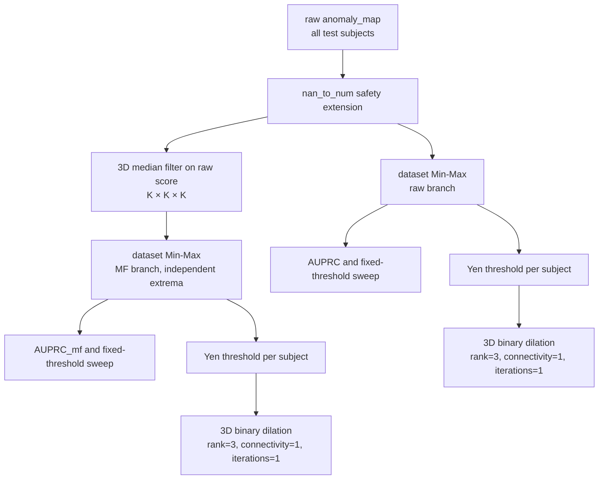
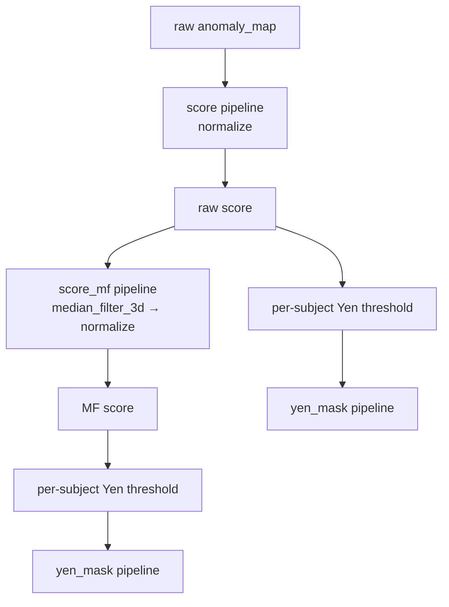

# ANDi anomaly-map postprocessing

本文只描述模型已產生 `raw anomaly_map [B, H, W, Z]` 之後的流程。DDPM、noise、timestep deviation、time aggregation 與 modality pooling 不在此 policy 內，也未因本功能而改變。

## 兩種模式

`metrics.postprocess_mode` 有兩個明確值：

- `rewrite`：保留可排序、可擴充的 score/mask registry pipeline。
- `original_andi`：重現 `AlexanderFrotscher/ANDi` 的 `eval.py` 後處理順序與 scope。

舊設定未提供 `postprocess_mode` 時，仍使用 legacy-compatible `rewrite`，因此既有實驗不會自動切換成原版流程。程式會顯示 `FutureWarning`，提醒新設定明確寫出模式。

## 原版 ANDi 流程



核心順序是：

```python
raw_mf = median_filter_3d(raw_maps)
score_raw = normalize_minmax(raw_maps, scope="dataset")
score_mf = normalize_minmax(raw_mf, scope="dataset")
```

MF 的輸入是未 normalize 的 raw score。raw 與 MF 分支各自取得自己的 dataset min/max，不能共用 extrema，也不能改成 `normalize -> median filter -> normalize`。

原版 `eval.py` 先收集完整測試集，才呼叫 `norm_tensor`。因此 `original_andi` 預設用整個 tensor 的一組 min/max，而不是讓每個 subject 各自變成 `[0, 1]`。

為避免模式名稱與實際 metric 語意不一致，`metrics.original_andi.normalization_scope` 只接受 `dataset`。若只想讓 prediction 檔使用 per-subject scaling，請另外設定 `prediction_output.normalization_scope: subject`；metadata 會清楚標記它和 metrics 不同。

Yen threshold 對每個 `[H, W, Z]` volume 分別呼叫一次 `threshold_yen`。它是 continuous score 轉 binary mask 的 thresholding stage，不是 mask postprocessor。Yen mask 之後才進入 mask pipeline。

預設 dilation 使用：

```python
structure = scipy.ndimage.generate_binary_structure(3, 1)
binary_dilation(mask, structure=structure, iterations=1)
```

`connectivity=1` 是中心 voxel 加六個 face neighbours，不是完整 26-neighbour 的 `3×3×3` 結構。fixed-threshold sweep 不套用這個 Yen-only dilation。

## Rewrite 流程

`rewrite` 完全依 YAML 的 ordered pipeline 執行。預設設定為：



score step 與 mask step 分開註冊。現有功能仍包含 2D/3D median filter、gray dilation、binary dilation、connected-component filtering 與任意 ordered pipeline。Yen threshold 由 policy 的 thresholding stage統一執行。

明確指定 `postprocess_mode: rewrite` 時，外層不會偷偷再做 Min-Max；所有 normalization 都能在 `describe()` 與 inference report 中看到。舊 config 的歷史 implicit normalization 會先編譯成明確步驟，連續且冗餘的 normalization 會合併。

## 設定方式

原版模式：

```yaml
metrics:
  postprocess_mode: original_andi
  original_andi:
    normalization_scope: dataset
    median_filter:
      enabled: true
      kernel_size: 5
      mode: 3d
    yen:
      binary_dilation:
        enabled: true
        rank: 3
        connectivity: 1
        iterations: 1

prediction_output:
  normalization_scope: dataset
```

可組合 rewrite 模式：

```yaml
metrics:
  postprocess_mode: rewrite
  postprocess:
    score:
      pipeline:
        - type: normalize
    score_mf:
      pipeline:
        - type: median_filter
          kernel_size: 5
          mode: 3d
        - type: normalize
    threshold_mask:
      pipeline: []
    yen_mask:
      pipeline:
        - type: binary_dilation
          rank: 3
          connectivity: 1
          iterations: 1

prediction_output:
  normalization_scope: subject
```

若同一份 YAML 會在兩種模式間切換，可使用 mode-specific mapping；scalar `dataset`／`subject` 仍完整支援：

```yaml
prediction_output:
  normalization_scope:
    rewrite: subject
    original_andi: dataset
```

可直接使用 [eval_original_andi.yaml](../configs/eval_original_andi.yaml)。預設 [eval.yaml](../configs/eval.yaml) 明確維持 `rewrite`，並保留兩種模式的設定範例。

## Detector、Evaluator、metrics 與 export

`PostprocessPolicy` 是單一真實來源。`ANDiDetector.postprocess()` 與 `VolumeEvaluator` 共用同一個 policy instance，兩者不再各自實作 normalization、Yen 或 dilation。對相同 raw tensor，兩個入口會產生相同的：

- normalized raw score；
- normalized MF score；
- raw/MF Yen thresholds；
- threshold 後的 raw/MF Yen masks；
- mask pipeline 後的 raw/MF masks。

Evaluator 的執行順序為：

1. 收集全部 raw maps 與 labels；
2. 以 metrics normalization scope 建立一個 `PostprocessResult`；
3. 從同一結果計算 fixed-threshold、Yen、AUPRC 與 rates；
4. 若 prediction scope 相同，直接把同一結果逐 subject 匯出。

`original_andi` 的 prediction 預設 scope 是 `dataset`；因此 `anomaly_score_raw.nii.gz`、`anomaly_score_mf.nii.gz` 與 `lesion_mask_yen.nii.gz` 使用 metrics 的同一份 processed score/mask。原版 repository 本身沒有這套 NIfTI export；這是 rewrite 的可追蹤擴充。

`rewrite` 可保留 `prediction_output.normalization_scope: subject`。這時 export 會逐 subject 重新執行同一 policy，而 metrics 仍可用 dataset scope。`prediction_metadata.json` 會記錄 `postprocess_mode`、實際 normalization scope、Yen source、完整 policy description 與 prediction 設定，避免把兩者誤認為同一 tensor。

若 `restore_native_grid: true` 且 model grid 與 native grid 尺寸不同，continuous score 需要 trilinear resampling、mask 使用 nearest-neighbour；因此 native-grid voxel values 可能是 processed tensor 的空間重採樣版本。grid 相同時 NIfTI values 與 metrics tensor 完全一致。

Standalone `ANDiDetector.detect()` 只看呼叫者提供的 batch；在 `dataset` scope 下，該 batch 就是可用的 normalization 集合。完整 evaluation 則會先 collect 全測試集，因此能重現原版 dataset-wide scope。

## 數值安全與報告

原版有限、非 constant 輸入的數學保持不變。rewrite 的安全擴充在 policy 中統一處理：

- `NaN`、`+Inf`、`-Inf` 轉為 `0`；
- denominator 以 `eps` 防止除零；
- constant tensor normalize 成全零；
- Yen 對 constant volume 產生空 mask。
- prediction 與 ground truth 都為空時 Dice 安全回傳 `0`，避免原版的 `0/0 -> NaN`。

`describe()`、`inference_report.json`、`inference_report.md` 與 prediction metadata 會列出：

- `postprocess_mode`；
- metrics normalization scope；
- raw score pipeline；
- MF score pipeline；
- Yen threshold strategy；
- mask pipeline 與 dilation settings；
- prediction export normalization scope。

## 執行

```bash
python scripts/eval.py \
  --config configs/eval_original_andi.yaml \
  --run-eval
```

Windows PowerShell 可使用單行等價命令：

```powershell
python scripts/eval.py --config configs/eval_original_andi.yaml --run-eval
```
